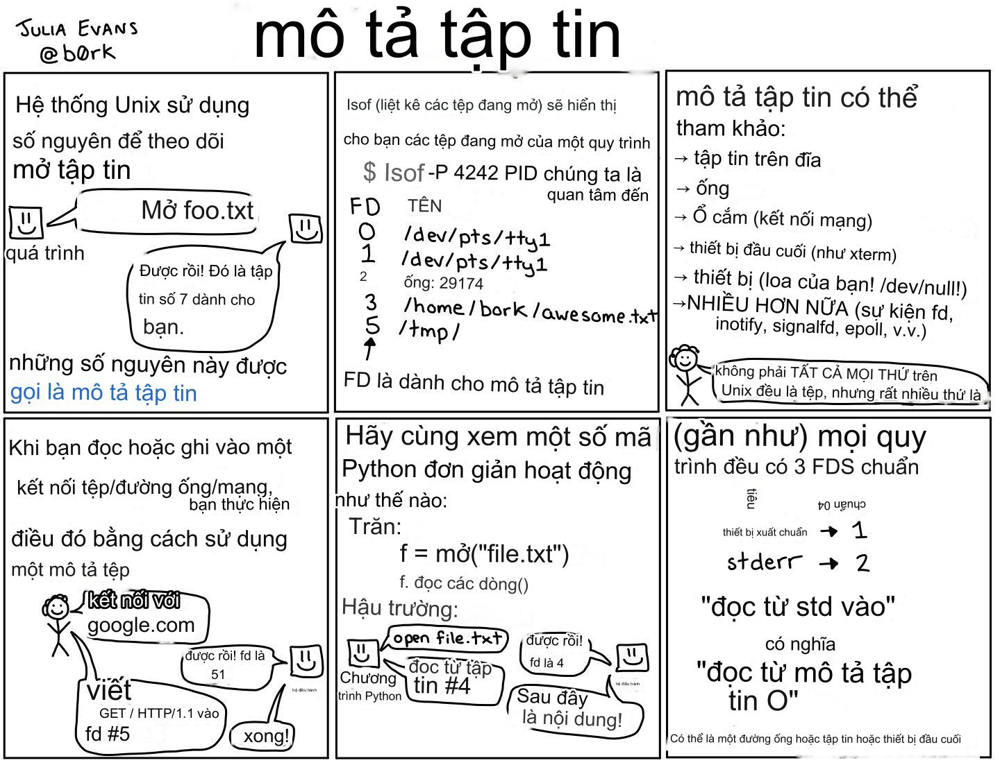

# Nhân hệ điều hành

Nhân hệ điều hành là một phần mềm đặc biệt. Đây là phần mềm được tải lên trước tất cả các chương trình khác của bạn ngay cả khi chúng cân nhắc việc khởi động. Nhân hệ điều hành thực hiện các công việc sau, tóm tắt:

1. Hệ điều hành thực thi mã ROM hoặc chỉ đọc
2. Hệ điều hành sau đó thực thi một `boot_loader` hoặc phần mở rộng `EFI` ngày nay
3. Boot_loader tải nhân của bạn
4. Nhân của bạn thực thi `init` để [khởi động](https://en.wikipedia.org/wiki/Bootstrapping) chính nó từ không có gì
5. Nhân thực thi các script khởi động
6. Nhân thực thi các script của người dùng, và bạn có thể sử dụng máy tính của mình!

Bạn không cần biết chi tiết quá trình khởi động, nhưng đó là nó. Khi bạn đang thực thi trong không gian người dùng, nhân cung cấp một số hoạt động quan trọng mà các chương trình không cần phải lo lắng.
* Lập lịch các quy trình và luồng; ngoài ra, xử lý các nguyên tắc đồng bộ hóa
* Cung cấp các System Call như `write` hoặc `read`
* Quản lý bộ nhớ ảo và các thiết bị nhị phân cấp thấp như trình điều khiển `usb`
* Xử lý việc đọc và hiểu một hệ thống tệp
* Xử lý việc giao tiếp qua mạng
* Xử lý việc giao tiếp với các quy trình khác
* Liên kết thư viện động

Nhân xử lý tất cả những việc này trong chế độ nhân. Chế độ nhân mang lại cho bạn sức mạnh lớn hơn, như thực hiện thêm các lệnh CPU nhưng với giá là một lỗi sẽ làm sập toàn bộ máy tính của bạn - ouch. Đó là những gì bạn sẽ tương tác trong lớp này.

### Bộ mô tả tệp

Một trong những thứ mà bạn đã quen thuộc là hệ điều hành cung cấp cho bạn các bộ mô tả tệp khi bạn mở các tệp văn bản. Dưới đây là một zine từ Julia Evans mô tả chi tiết hơn.



Như zine nhỏ cho thấy, Nhân hệ điều hành theo dõi các bộ mô tả tệp và những gì chúng trỏ đến. Chúng ta sẽ thấy sau này rằng các bộ mô tả tệp không cần phải trỏ đến các tệp thực sự và hệ điều hành theo dõi chúng cho bạn. Ngoài ra, hãy lưu ý rằng giữa các quy trình, các bộ mô tả tệp có thể được tái sử dụng nhưng bên trong một quy trình, chúng là duy nhất.

Bộ mô tả tệp cũng có khái niệm vị trí. Bạn có thể đọc hoàn toàn một tệp trên đĩa vì hệ điều hành theo dõi vị trí trong tệp, và điều đó thuộc về quy trình của bạn.

## Tuyệt, vậy shell là gì?

Shell thực sự là cách bạn sẽ tương tác với nhân hệ điều hành. Trước khi có hệ điều hành thân thiện với người dùng, khi một máy tính khởi động, tất cả những gì bạn có quyền truy cập là một shell. Điều này có nghĩa là tất cả các lệnh và chỉnh sửa của bạn phải được thực hiện theo cách này. Ngày nay, máy tính của chúng ta khởi động ở chế độ desktop, nhưng bạn vẫn có thể truy cập vào một shell bằng cách sử dụng một terminal. Khi bạn mở một cái, bạn nên thấy điều gì đó như thế này

```
(Stuff) $
```

Nó đã sẵn sàng cho lệnh tiếp theo của bạn! Bạn có thể gõ vào rất nhiều tiện ích unix như `ls`, `echo Hello` và shell sẽ thực thi chúng và đưa ra kết quả cho bạn. Một số trong số này được biết đến là `shell-builtins` có nghĩa là mã nằm trong chương trình shell. Một số trong số này là các chương trình đã biên dịch mà bạn chạy. Shell chỉ tìm kiếm thông qua một biến đặc biệt gọi là path chứa danh sách các đường dẫn được phân tách bằng `:` để tìm kiếm một tệp thực thi với tên của bạn, dưới đây là một ví dụ về path..

```
$ echo $PATH
/usr/local/sbin:/usr/local/bin:/usr/sbin:/usr/bin:/sbin:/bin:/usr/games:/usr/local/games
```

Vì vậy, khi shell thực thi `ls`, nó sẽ tìm qua tất cả các thư mục đó, tìm `/bin/ls` và thực thi nó.


```
$ ls
...
$ /bin/ls
```


Bạn luôn có thể gọi thông qua đường dẫn đầy đủ. Đó cũng là lý do tại sao trong các lớp học trước, nếu bạn muốn chạy một thứ gì đó trên terminal, bạn đã phải làm `./exe` bởi vì thường thì thư mục bạn đang làm việc không nằm trong biến `PATH`. Dấu `.` mở rộng thành thư mục hiện tại của bạn và shell thực thi `<current_dir>/exe` đó là một lệnh hợp lệ.

### Mẹo và lời khuyên về Shell
* Mũi tên lên sẽ lấy cho bạn lệnh gần nhất của bạn
* `ctrl-r` sẽ tìm kiếm các lệnh mà bạn đã thực thi trước đó
* `ctrl-c` sẽ gián đoạn quá trình của shell
* Thêm nhiều hơn nữa!

## Vậy thì terminal là gì?

Terminal chỉ là một ứng dụng hiển thị đầu ra từ shell. Bạn có thể có terminal mặc định của mình, terminal dựa trên quake, terminator, các tùy chọn là vô tận!